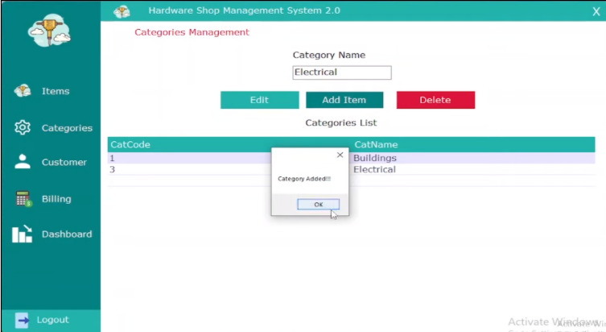
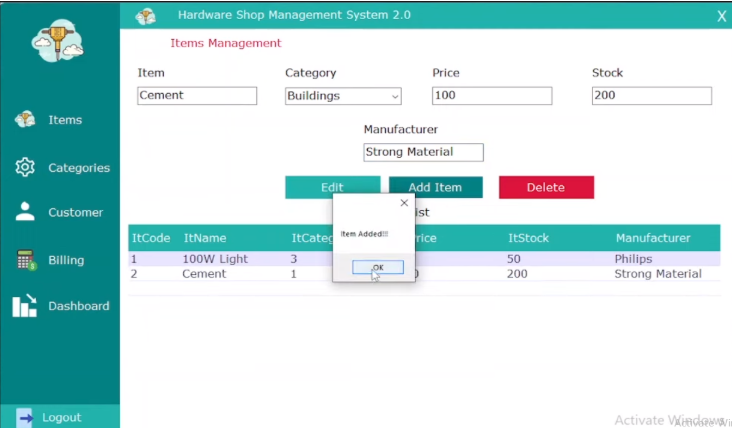

# 🛠️ Hardware-Shop-Management

The **Hardware Management System** is a desktop-based application built using **C# Windows Forms** and **SQL Server**, designed to handle billing and inventory for a hardware store. It allows staff to manage items, stock, customers, and generate bills with automatic stock deduction.

---

## 📱 Features

- 🧾 **Billing System**: Add items to bill with quantity, auto-calculate totals
- 📦 **Stock Management**: Automatically deducts stock upon billing
- 🧑‍💼 **Customer Management**: Add/view customer records
- 🏷️ **Item & Category Management**: CRUD operations for inventory
- 💳 **Payment Modes**: Supports Cash, Card, and Mobile payments
- 🧮 **Real-time Summary**: Displays running total and updates stock
- 🖨️ **Print Bill**: Save bill data to database for future reference

---

## 🖼️ Interface Preview

### Category Management

### Items Management

---
## 🛠 Tech Stack

- **Language**: C#
- **Platform**: Windows Forms (.NET Framework)
- **Database**: SQL Server
- **IDE**: Visual Studio 2022

---

## 🗂️ Database Structure

### 🧾 `Bill` Table

| Field    | Type      | Description                  |
|----------|-----------|------------------------------|
| `Id`     | INT       | Primary Key (Auto-increment) |
| `BDate`  | DATE      | Bill Date                    |
| `Name`   | VARCHAR   | Customer Name                |
| `Amount` | INT       | Grand Total                  |
| `PaymentMode`   | VARCHAR   | Payment Method               |

### 📦 `Item` Table

| Field     | Type      | Description         |
|-----------|-----------|---------------------|
| `ItCode`  | INT       | Primary Key         |
| `ItName`  | VARCHAR   | Item Name           |
| `Price`   | INT       | Price per unit      |
| `Stock`   | INT       | Available quantity  |

---

## 📝 Notes

- Make sure SQL Server is running and the database is created before using the app
- Data is fetched using SQL queries through a helper class (`Functions.cs`)
- Make sure to properly handle connection strings and exceptions in production

---
